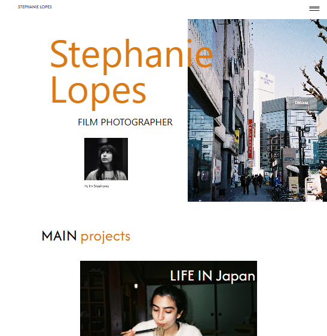

# Photographer Portfolio — Stephanie Lopes
## Analog Photography Portfolio

**Author: Stephanie Lopes**

This project is my MVP for Sprint 3 of the Full Stack Development course at PUC-Rio (2024–2025).

**Objective:**  
To create a personal website for showcasing analog photography, including a contact form for professional partnerships and a client registration system, enabling future newsletter distribution.  

Using a personal website as a portfolio eliminates the need for generic portfolio platforms and conveys a stronger sense of professionalism and trust to clients and partners.

---

## Project Preview



**Live Demo:**  
https://stephanie-portfolio-interface.vercel.app/home

---

## How It Works

The project follows **Architecture Scenario 1.1**, where:

- The main component is the **frontend interface**
- The secondary component is the **client registration API**
- The external API is **Brevo (email sending and receiving)**

The system uses 6 routes:
```
POST /client
GET /client
GET /clients
PUT /client
DELETE /client
POST /contact # external API communication
```

---

## Pages
```
About.js - Information about the portfolio author
AlbumDetails.js - Displays all photos within albums
ContactPage.js - Contact form page
InicialPage.js - Homepage
PortfolioPage.js - Displays all albums
SubscribePage.js - Newsletter subscription page
```
---

## Components
```
Banner.jsx - Used on 2 pages for marketing/CTA
ContactForm.jsx - Contact form
FooterMenu.jsx - Present on all pages
Header.jsx - Present on all pages
HeroSection.jsx - Homepage presentation section
Item.jsx - Album card + interaction (expand album)
MenuOverlay.jsx - Navigation menu (all pages)
Portfolio.jsx - Album display component
SubscribeForm.jsx - Client registration form
```

---

## Data Structure

Portfolio data (images) are stored in:
```
"albuns": [
        {
            "id": 1,
            "title": "LIFE IN Japan",
            "image": "/assets/images/japan_life/007.jpg",
            "photos": [
                {
                    "src": "/assets/images/japan_life/001.jpg",
                    "name": "Imagem 1"
                },
                {
                    "src": "/assets/images/japan_life/002.JPG",
                    "name": "Imagem 2"
                },
                            .
                            .
                            .
                {
                    "src": "/assets/images/ALBUM_X/FOTO_XXX.JPG",
                    "name": "Imagem XXX"
                }
```
Following the sequential numbering pattern, where I placed the Xs in the last lines.

**The data is called by the InitialPage.js page, componentized by the Item.jsx and Portfolio.jsx files, and displayed by the PortfolioPage.js page.**

## How to run

To run the project, you must first have the folders listed below.
```
public
src
```
And the subfolders:
```
public
    - assets
        - images
            - birthday
            - brasil_life
            - cultural_events
            - japan_life
src
    - assets
        - fonts
        - icons
        - images
    - components
    - pages
```

Before running, you need to install the npm package manager, the react-bootstrap framework, and the sass style package.

Install dependencies:
```
npm install
```
Run the application:
```
npm start
```

## How to run via Docker

Make sure you have [Docker](https://docs.docker.com/engine/install/) installed and running on your machine.

Navigate to the directory containing the Dockerfile and requirements.txt in the terminal.
Run the following command **as administrator** to build the Docker image:

```
docker build -t stephanie-portfolio-interface .
```

Once the image is created, to run the container simply execute the following command **as administrator**:

```
docker run -p 3000:3000 stephanie-portfolio-interface
```

Once running, to access the API, simply open [http://localhost:3000/#/](http://localhost:3000/#/) in your browser.

### Some useful Docker commands

**To verify that the image was created, you can run the following command:

```
$ docker images
```

If you want to **remove an image**, simply run the command:
```
$ docker rmi <IMAGE ID>
```
Replacing `IMAGE ID` with the image code

**To check if the container is running, you can execute the following command:

```
$ docker container ls --all
```

If you want to **stop a container**, simply run the command:
```
$ docker stop <CONTAINER ID>
```
Replacing `CONTAINER ID` with the container ID.


If you want to **destroy a container**, simply run the command:
```
$ docker rm <CONTAINER ID>
```
For more commands, see the [Docker documentation](https://docs.docker.com/engine/reference/run/).


## Instructions for use

After the project is successfully completed, you will be able to explore the website pages. The pages are:

```
1. Home
2. Portfolio
    2.1 Album 1: "Life in Japan"
    2.2 Album 2: "Cultural Events"
    2.3 Album 3: "Birthday"
    2.4 Album 4: "Life in Brazil"
3. About
4. Contact
5. Subcribe
6. Menu sobreposto (Acesso às demais páginas)
```

The main way to get the photos is:
```
Home > Album do Portfolio > Clique em um álbum > Fotos
```
The way to contact us is:
```
Home > Três linhas à direita superior > Contact > Prencher Formulário > Submit
```
The registration process is as follows:
```
Home > Três linhas à direita superior > Subscribe > Prencher Formulário > Submit
```
All pages can be easily accessed via the overlay menu, which is available in the upper right corner of every page, or via the Footer, located at the bottom of every page.

## Next Steps (2026)
- Responsive design for mobile and tablet
- Online release - Hosting on Vercel
- Front and Back end specs to follow on shared points (basead on market and what I like)

---------------------------------------
[Portuguese]

# Photographer-Portfolio-Stephanie-Lopes
## Portfólio de fotografia analógica
**Autor: Stephanie Lopes**

Este projeto é o meu MVP da Sprint 3 do curso de Desenvolvimento Full Stack Básico da PUC RIO, 2024-2025.

Objetivo: Criação de website pessoal para divulgação de fotografias analógicas, campo de contato para parcerias de trabalho e registro de clientes, viabilizando o futuro envio de newsletter. O uso de uma website pessoal como portfólio exclui a necessidade do uso de websites genéricos de portfólio e emite uma mensagem de maior profissionalismo e confiança para clientes e parceiros.

## Preview do Projeto


Link deploy: https://stephanie-portfolio-interface.vercel.app/home

## Como Funciona

Utilizando a arquitetura do cenário 1.1, o componente principal sendo essa interface, o secundário a API de registro de clientes e a API externa sendo a API Brevo (envio e recebimento de e-mails)

O projeto faz uso de 6 rotas:
```
POST/client
GET/client
GET/clients
PUT/client
DELETE/client
POST/contact - comunicação com API externa
```


As páginas do projeto:
```
About.js - Página com informações sobre a autora do portfólio
AlbumDetails.js - Página para exibição de todas as fotografias dos álbuns
ContactPage.js - Página com formulário para contato com a autora
InicialPage.js - Página inicial do website
PortfolioPage.js - Página com a lista de todos os álbuns
SubscribePage.js - Página para cadastro de clientes que gostariam de receber newsletter
```
E também, nove componentes:
```
Banner.jsx - Utilizado em 2 páginas e serve para chamada de marketing para cliente e parceiros.
ContactForm.jsx - Utilizado em 1 página, para formulário de contato.
FooterMenu.jsx - Utilizado em todas as 5 páginas.
Header.jsx - Utilizado em todas as 5 páginas.
HeroSection.jsx - Utilizado em 1 página, para apresentação do website.
Item.jsx - Utilizado em 2 páginas, para crianção do card os álbuns e da interatividade de clicar no álbum e visualizar o álbum expandido.
MenuOverlay.jsx - Utilizado em todas as 5 páginas
Portfolio.jsx - Utilizado em 2 páginas, para mostragem dos álbuns.
SubscribeForm.jsx - Utilizado em 1 página, para registro de clientes.
```

Os dados que alimentam o portfólio, as fotografias usadas, estão no arquivo albunsCollection.json. A estrutura dos álbuns está definida na estrutura:
```
"albuns": [
        {
            "id": 1,
            "title": "LIFE IN Japan",
            "image": "/assets/images/japan_life/007.jpg",
            "photos": [
                {
                    "src": "/assets/images/japan_life/001.jpg",
                    "name": "Imagem 1"
                },
                {
                    "src": "/assets/images/japan_life/002.JPG",
                    "name": "Imagem 2"
                },
                            .
                            .
                            .
                {
                    "src": "/assets/images/ALBUM_X/FOTO_XXX.JPG",
                    "name": "Imagem XXX"
                }
```
Seguindo o padrão de númeração sequencial, onde coloquei os Xs nas últimas linhas.

**Os dados são chamados pela página InicialPage.js, componentizados pelos arquivos Item.jsx e Portfolio,jsx e exibidos pela página PortfolioPage.js.**

## Como executar

Para executar o projeto, primeiramente, deve conter as pastas listadas abaixo.
```
public
src
```
E as sub pastas:
```
public
    - assets
        - images
            - birthday
            - brasil_life
            - cultural_events
            - japan_life
src
    - assets
        - fonts
        - icons
        - images
    - components
    - pages
```

Antes de executar, é necessário instalar o gerenciador de pacotes npm, o framework react-bootstrap e o pacote de estilos sass.

Instalar dependencias:
```
npm install
```
Executar a aplicação:
```
npm start
```

## Como executar através do Docker

Certifique-se de ter o [Docker](https://docs.docker.com/engine/install/) instalado e em execução em sua máquina.

Navegue até o diretório que contém o Dockerfile e o requirements.txt no terminal.
Execute **como administrador** o seguinte comando para construir a imagem Docker:

```
docker build -t stephanie-portfolio-interface .
```

Uma vez criada a imagem, para executar o container basta executar, **como administrador**, seguinte o comando: 

```
docker run -p 3000:3000 stephanie-portfolio-interface
```

Uma vez executando, para acessar a API, basta abrir o [http://localhost:3000/#/](http://localhost:3000/#/) no navegador.


### Alguns comandos úteis do Docker

**Para verificar se a imagem foi criada** você pode executar o seguinte comando:

```
$ docker images
```

 Caso queira **remover uma imagem**, basta executar o comando:
```
$ docker rmi <IMAGE ID>
```
Subistituindo o `IMAGE ID` pelo código da imagem

**Para verificar se o container está em exceução** você pode executar o seguinte comando:

```
$ docker container ls --all
```

 Caso queira **parar um container**, basta executar o comando:
```
$ docker stop <CONTAINER ID>
```
Subistituindo o `CONTAINER ID` pelo ID do conatiner


 Caso queira **destruir um conatiner**, basta executar o comando:
```
$ docker rm <CONTAINER ID>
```
Para mais comandos, veja a [documentação do docker](https://docs.docker.com/engine/reference/run/).


## Instruções de uso

Após a execução com sucesso do projeto, será possível explorar as páginas do website. As páginas são:

```
1. Home
2. Portfolio
    2.1 Album 1: "Life in Japan"
    2.2 Album 2: "Cultural Events"
    2.3 Album 3: "Birthday"
    2.4 Album 4: "Life in Brazil"
3. About
4. Contact
5. Subcribe
6. Menu sobreposto (Acesso às demais páginas)
```

Os principal caminho para alcançar as fotos é:
```
Home > Album do Portfolio > Clique em um álbum > Fotos
```
O caminho para contato é:
```
Home > Três linhas à direita superior > Contact > Prencher Formulário > Submit
```
O caminho para inscrição é:
```
Home > Três linhas à direita superior > Subscribe > Prencher Formulário > Submit
```
Todas as páginas podem ser facilmente acessadas pelo menu sopreposto, que está disponível no canto direito superior em todas as páginas, ou pelo Footer, presente no final de todas as páginas.

## Próximos passos (2026)
- Responsividade para celular e tablet
- Release online - Hospedagem
